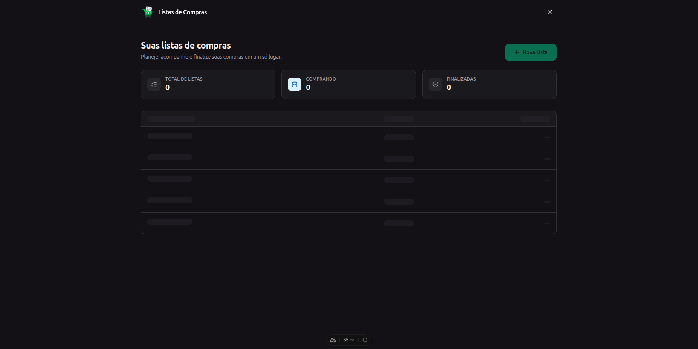
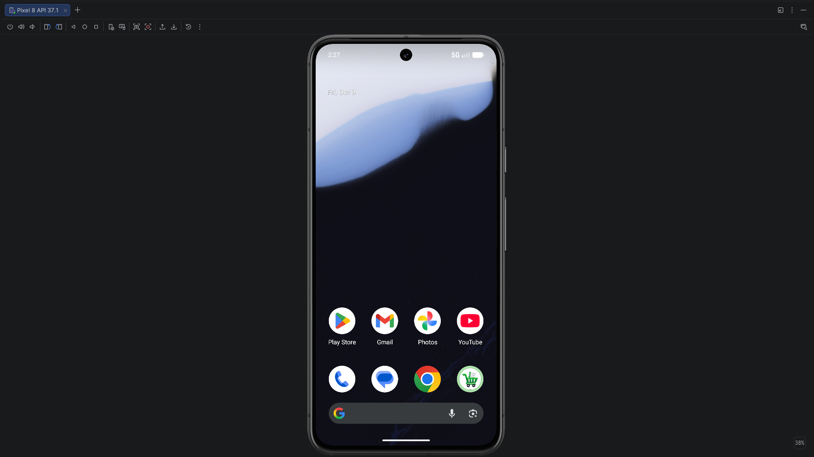

## Apresentação Geral

**Nome do Projeto:** Shopping List

**Descrição:**

O Shopping List é uma aplicação de lista de compras desenvolvida com Nuxt, Vue.js, TypeScript e Tailwind. Utilizando o Capacitor, o projeto pode ser executado tanto em navegadores Web quanto em dispositivos Android, reaproveitando a mesma base de código para os dois ambientes.

A aplicação utiliza uma abordagem inspirada em Clean Architecture, buscando separar as regras de negócio dos detalhes de interface, persistência e plataforma. No ambiente Android, a persistência local é realizada com SQLite, permitindo o uso da aplicação sem depender de um servidor remoto para armazenar as listas.




**Objetivo:**

Desenvolver uma aplicação multiplataforma para gerenciamento de listas de compras, explorando a integração entre Nuxt, Capacitor e SQLite, além da aplicação de princípios de Arquitetura Limpa em um projeto prático.

**Tecnologias Utilizadas:**


## Para Desenvolvedores

Se você é um desenvolvedor interessado em contribuir ou entender melhor o funcionamento do projeto, aqui estão algumas informações adicionais:

**Ambiente:**


**Pré-requisitos:**

- Docker e Docker Compose, para executar o ambiente Web.
- Node.js e npm, para executar os comandos de build e integração com o Capacitor.
- Android Studio e um dispositivo ou emulador Android, para executar a aplicação nativamente.

**Instruções de Instalação e Configuração:**

1. Clone o repositório do projeto:
```
git clone https://github.com/edssaac/shopping-list
```

2. Navegue até o diretório do projeto:
```
cd shopping-list
```

### **Execução no ambiente Web**

> O Docker Compose está configurado para executar a aplicação em ambiente Web, utilizando o servidor de desenvolvimento do Nuxt.

3. Inicie a aplicação atráves do Docker:
```
docker compose up -d --build
```

4. Configure o banco de dados local com as migrations disponíveis:
```
docker exec -it shopping-list-app npm run db:setup
```

5. Acesse a aplicação pelo navegador:
```
http://localhost:3000/
```

### **Execução no ambiente Android**

**Pré-requisitos para o Android:**

- Node.js e npm instalados no sistema.
- Android Studio configurado com o Android SDK.
- Um emulador Android configurado ou um dispositivo físico conectado.
- Dependências do projeto instaladas.

6. Instale as dependências do projeto, caso ainda não estejam instaladas:
```
npm install
```

7. Gere os recursos visuais do Android, caso tenha alterado os arquivos de ícone ou splash screen:
```
npm run cap:assets-android
```

8. Gere a versão Web que será utilizada pelo Capacitor:
```
npm run generate
```

9. Sincronize os arquivos gerados e os plugins com o projeto Android:
```
npm run cap:sync-android
```

10. Abra o projeto Android no Android Studio:
```
npm run cap:open-android
```

11. No Android Studio, aguarde a sincronização do Gradle, selecione um dispositivo ou emulador e clique em Run para instalar e executar a aplicação.

**Fluxo de atualização:**

12. Após modificar o código da aplicação Web, execute novamente os comandos de geração e sincronização antes de executar o projeto pelo Android Studio:
```
npm run generate
npm run cap:sync-android
```

Em seguida, execute novamente a aplicação pelo Android Studio.

## Contato

[](https://github.com/edssaac)
[](mailto:edssaac@gmail.com)
[](mailto:edssaac@outlook.com)
[](https://www.linkedin.com/in/edssaac)
